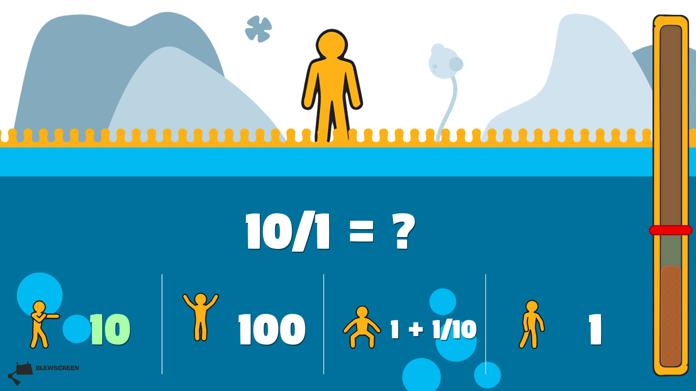
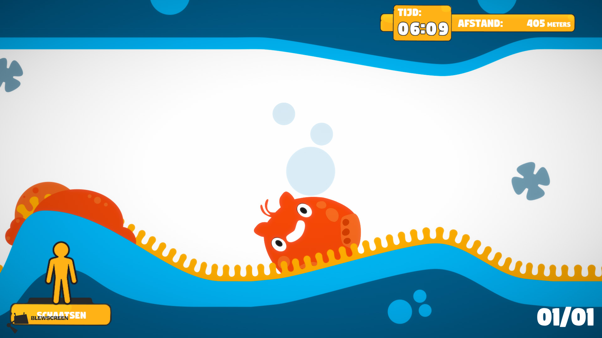

DIM is the name of the project and contains two games under the same umbrella: DIM Energizer and DIM Move Your Brain.

Move Your Brain is a math game where kids in a classroom have to perform a certain gesture together to reveal a math question, and then answer this math question by performing another gesture that matches the gesture with the correct answer on the board. This way the class is constantly in motion, from the moment the game starts until the moment the game is over.

The Energizer is more of a typical game than Move Your Brain. In the Energizer the class all plays a shared character, which they have to move forward by collaborating and all making the correct gesture. If the class succeeds the Blob will move forward. Every meter forward is another point on the high score, so classes get motivated to compete with other classes from the same school.

Project description on the BlewScreen website:

[https://www.blewscreen.com/portfolio-item/dim-energie-in-de-klas/](https://www.blewscreen.com/portfolio-item/dim-energie-in-de-klas/)